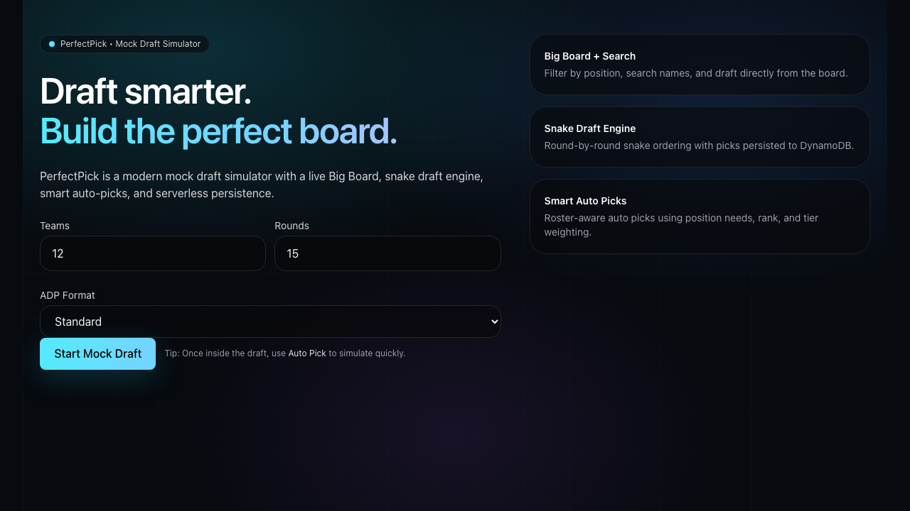
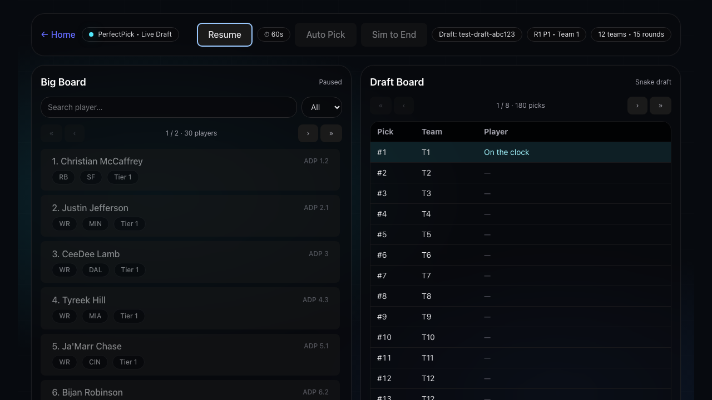
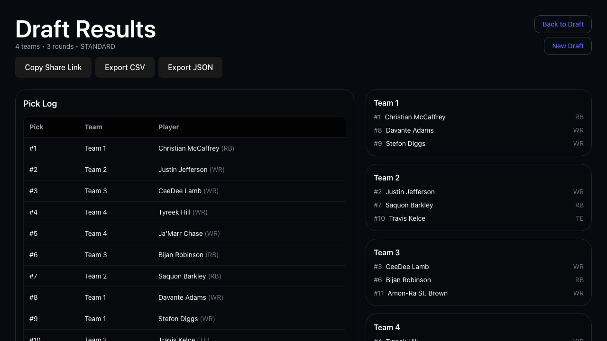

# PerfectPick — Fantasy Football Mock Draft Simulator

PerfectPick is a modern, serverless fantasy football mock draft simulator. Configure your league settings, pick your players from a live Big Board, and outsmart the competition with ADP-powered rankings and smart auto-picks.

---

## Screenshots

### Home Page


### Live Draft Board


### Draft Results


---

## Features

- **Snake Draft Engine** — Round-by-round snake ordering with full persistence to DynamoDB
- **Big Board + Search** — Filter by position, search by name, and paginate through the full player pool
- **Smart Auto Picks** — Roster-aware auto picks weighted by ADP rank, position needs, and tier
- **60-Second Clock** — Countdown timer for Team 1; auto-picks on timeout
- **Sim to End** — Instantly simulate all remaining picks to complete a draft
- **Pause / Resume** — Freeze the draft clock at any time
- **Shareable Drafts** — Every draft gets a unique ID you can share via link
- **Export** — Download your completed draft as CSV or JSON
- **ADP Formats** — Standard, Half PPR, and PPR scoring supported

---

## Tech Stack

### Frontend
| Tool | Version |
|------|---------|
| React | 19 |
| Vite | 7 |
| React Router | 7 |
| Tailwind CSS | 4 |

### Backend
| Service | Purpose |
|---------|---------|
| AWS Lambda (Node.js 20) | API handler functions |
| AWS DynamoDB | Draft and player persistence |
| AWS API Gateway (HTTP API) | REST API routing |
| AWS CloudFront | Static frontend hosting |
| AWS SAM | Infrastructure as code |

---

## Architecture

```
Browser (React + Vite)
    │
    │  HTTPS
    ▼
CloudFront (CDN)
    │
    ├─── Static assets (S3)
    │
    └─── API calls
          │
          ▼
    API Gateway (HTTP)
          │
          ├── GET  /players              → PlayersFunction
          ├── POST /drafts               → DraftsFunction
          ├── GET  /drafts/:id           → DraftsFunction
          ├── POST /drafts/:id/pick      → DraftsFunction
          ├── POST /drafts/:id/auto-pick → DraftsFunction
          └── POST /drafts/:id/sim-to-end→ DraftsFunction
                    │
                    ▼
              DynamoDB
              ├── perfectpick-drafts
              └── perfectpick-players
```

Player ADP data is synced nightly via a scheduled `SyncPlayersFunction` Lambda.

---

## Getting Started

### Prerequisites
- Node.js 20+
- AWS CLI configured with appropriate permissions
- AWS SAM CLI (for backend)

### Frontend

```bash
cd frontend
npm install

# Create a local env file pointing at your deployed API
echo "VITE_API_BASE_URL=https://your-api-gateway-url" > .env.local

npm run dev
```

Open [http://localhost:5173](http://localhost:5173).

### Backend

```bash
cd backend
sam build
sam deploy --guided   # follow prompts to set stack name, region, etc.
```

The deploy outputs the `ApiBaseUrl` — use that as `VITE_API_BASE_URL`.

---

## Testing

Tests use [Playwright](https://playwright.dev) with fully mocked API routes — no live backend required.

```bash
cd frontend
npm test              # run all tests headlessly
npm run test:headed   # run with a visible browser
npm run test:ui       # open the Playwright interactive UI
```

The suite covers 30 tests across three pages:

| Suite | Tests |
|-------|-------|
| Home page | Rendering, form defaults, navigation, error handling |
| Draft page | Big Board, search/filter, pick, auto-pick, sim, timer, pause |
| Results page | Pick log, rosters, share link, CSV/JSON export, navigation |

Screenshots are written to `screenshots/` on each test run.

---

## Deploying

### Frontend

```bash
cd frontend
npm run deploy
```

This builds the app, syncs to S3, and invalidates the CloudFront cache.

### Backend

```bash
cd backend
sam build && sam deploy
```

---

## Project Structure

```
sports-mock-draft/
├── frontend/
│   ├── src/
│   │   ├── pages/
│   │   │   ├── Home.jsx       # Draft setup screen
│   │   │   ├── Draft.jsx      # Live draft board
│   │   │   └── Results.jsx    # Post-draft results
│   │   └── lib/
│   │       └── api.js         # Fetch wrapper
│   ├── tests/
│   │   ├── fixtures.js        # Mock data + helpers
│   │   ├── home.spec.js
│   │   ├── draft.spec.js
│   │   └── results.spec.js
│   └── playwright.config.js
├── backend/
│   ├── src/
│   │   ├── drafts.js          # Draft CRUD + snake engine + auto-pick logic
│   │   ├── players.js         # Player query handler
│   │   └── syncPlayers.js     # Nightly ADP sync
│   └── template.yaml          # SAM infrastructure definition
└── screenshots/               # Auto-generated by test suite
```
