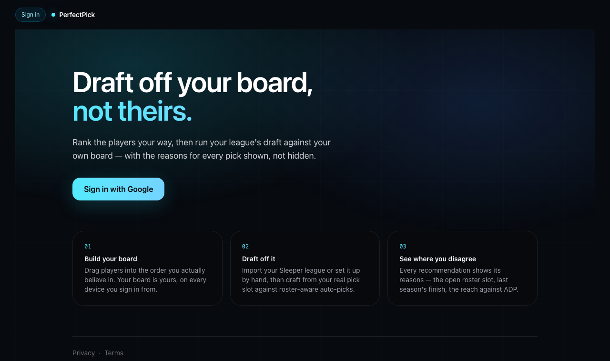
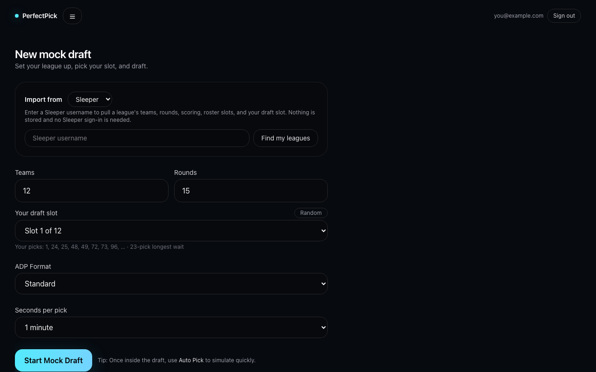
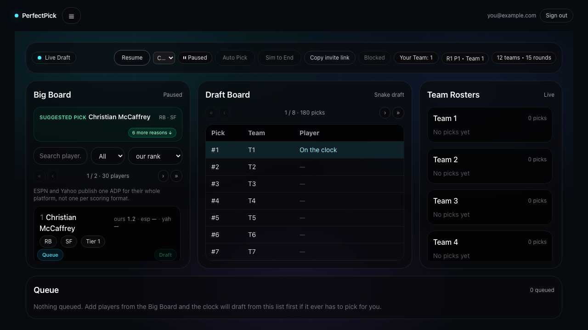
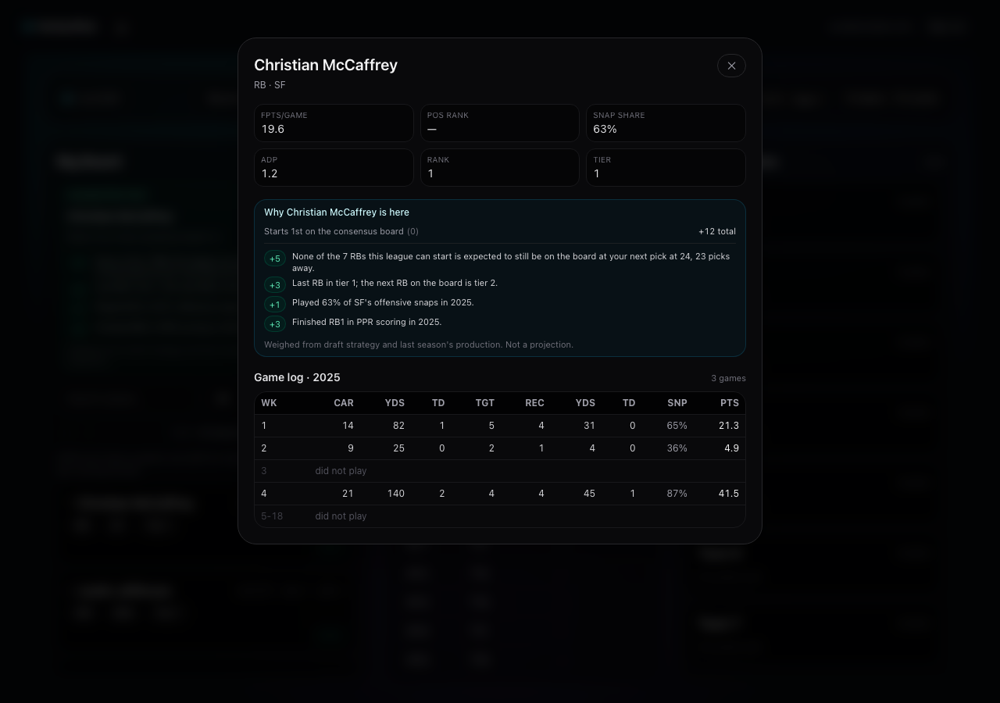
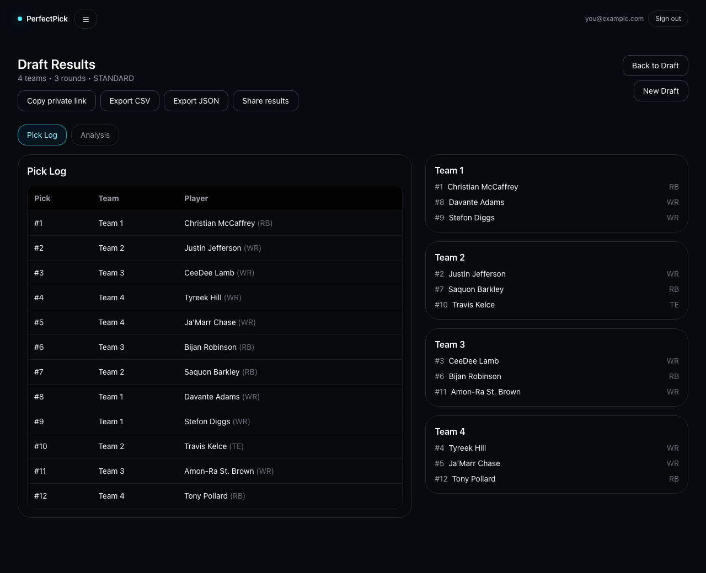
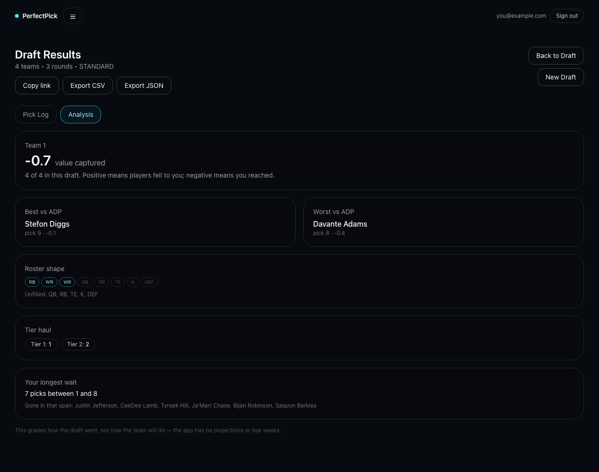
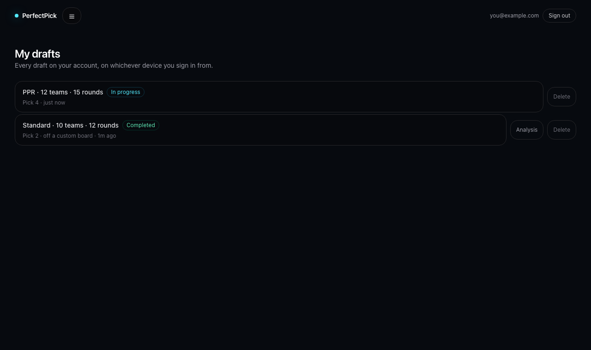
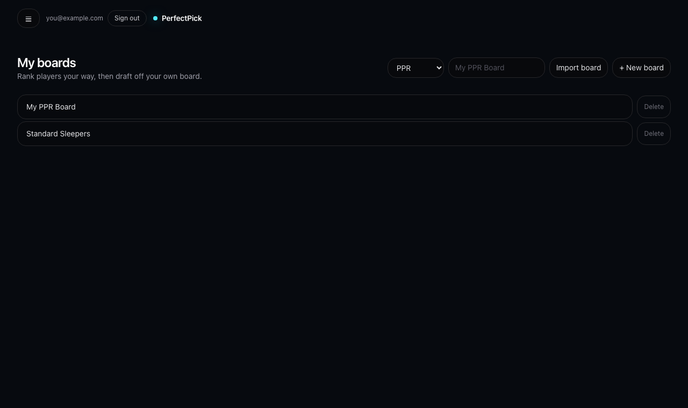
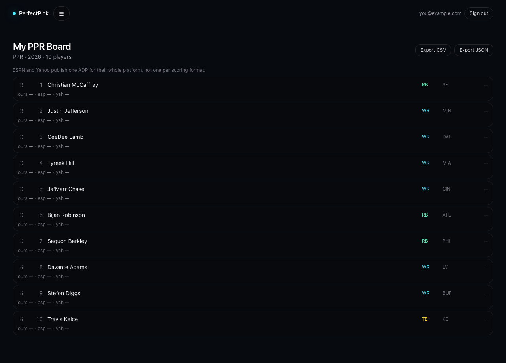

# PerfectPick — Fantasy Football Mock Draft Simulator

PerfectPick is built around the board, not the draft. Rank players your way,
then run your league's mock draft off your own board instead of the
consensus one — with the reasoning behind every recommended pick shown, not
hidden. Sign in, and your boards and drafts follow you to any device.

---

## Screenshots

### Home


The landing page a signed-out visitor sees: the pitch is the board, not the
draft engine underneath it.

### New Draft


### Live Draft Board


### Player drill-down

Click any player — on the draft board or in a big board — for their season
line, a week-by-week game log, and the reasons the engine ranks them where it
does. Weeks they missed show as gaps rather than rows of zeroes, and a rookie's
empty log says so rather than claiming he sat out.

The same detail lives at `/player/:id`, so a player can be linked to directly.
That page carries no draft advice: the engine's reasons are about a decision at
a particular pick, and a standalone page has no pick to advise on.



### Draft Results


### Draft Analysis


### My Drafts


### My Boards


### Board Editor


---

## Features

- **Sign-in Required** — Google sign-in via Cognito; drafts and boards are private to the people in them, not to anyone who merely has the link
- **Custom Big Boards** — Rank players your way, save the board, and draft off it instead of the consensus order
- **Snake Draft Engine** — Round-by-round snake ordering with full persistence to DynamoDB
- **Big Board + Search** — Filter by position, search by name, and paginate through the full player pool
- **Smart Auto Picks** — Roster-aware auto picks weighted by ADP rank, position needs, and tier
- **60-Second Clock** — Countdown timer for Team 1; auto-picks on timeout
- **Sim to End** — Instantly simulate all remaining picks to complete a draft
- **Pause / Resume** — Freeze the draft clock at any time
- **Export** — Download your completed draft as CSV or JSON
- **ADP Formats** — Standard, Half PPR, and PPR scoring supported

---

## Tech Stack

### Frontend
| Tool | Version |
|------|---------|
| React | 19 |
| Vite | 7 |
| React Router | 7 |
| Tailwind CSS | 4 |

### Backend
| Service | Purpose |
|---------|---------|
| AWS Lambda (Node.js 20) | API handler functions |
| AWS DynamoDB | Draft and player persistence |
| AWS API Gateway (HTTP API) | REST API routing |
| AWS CloudFront | Static frontend hosting |
| AWS SAM | Infrastructure as code |

---

## Architecture

```
Browser (React + Vite)
    │
    │  HTTPS
    ▼
CloudFront (CDN)
    │
    ├─── Static assets (S3)
    │
    └─── API calls
          │
          ▼
    API Gateway (HTTP)
          │
          ├── GET  /players              → PlayersFunction
          ├── POST /drafts               → DraftsFunction
          ├── GET  /drafts/:id           → DraftsFunction
          ├── POST /drafts/:id/pick      → DraftsFunction
          ├── POST /drafts/:id/auto-pick → DraftsFunction
          └── POST /drafts/:id/sim-to-end→ DraftsFunction
                    │
                    ▼
              DynamoDB
              ├── perfectpick-drafts
              └── perfectpick-players
```

Player ADP data is synced nightly via a scheduled `SyncPlayersFunction` Lambda.

---

## Getting Started

### Prerequisites
- Node.js 20+
- AWS CLI configured with appropriate permissions
- AWS SAM CLI (for backend)

### Frontend

```bash
cd frontend
npm install

# Create a local env file pointing at your deployed API
echo "VITE_API_BASE_URL=https://your-api-gateway-url" > .env.local

npm run dev
```

Open [http://localhost:5173](http://localhost:5173).

### Backend

`GoogleClientId` and `GoogleClientSecret` have no default, so the deploy fails
without them. Complete the [Sign-in setup](#sign-in-setup-one-time-manual)
section below first if you haven't already; it walks through getting both.

```bash
cd backend
sam build
sam deploy --parameter-overrides \
  GoogleClientId=YOUR_CLIENT_ID \
  GoogleClientSecret=$(aws ssm get-parameter \
    --name /perfectpick/google-client-secret --with-decryption \
    --query Parameter.Value --output text)
```

**Not `sam deploy --guided`.** It offers to save your answers to
`backend/samconfig.toml`, which this repo tracks in git, and it writes
parameter values there in plaintext — `NoEcho` keeps the secret out of console
output and stack events, not out of that file. One prompt answered on autopilot
is all it takes to commit the secret. Pass the parameters explicitly instead,
the same way every deploy does.

The deploy outputs the `ApiBaseUrl` — use that as `VITE_API_BASE_URL`.

---

## Testing

Tests use [Playwright](https://playwright.dev) with fully mocked API routes — no live backend required.

```bash
cd frontend
npm test              # run all tests headlessly
npm run test:headed   # run with a visible browser
npm run test:ui       # open the Playwright interactive UI
```

Three suites run against this project:

| Suite | Command | What it covers |
|-------|---------|----------------|
| Backend unit | `cd backend/src && npm test` | Handlers, response shaping, gzip negotiation, DynamoDB pagination, roster and snake logic |
| Frontend unit | `cd frontend && npm run test:unit` | Pure modules — board ordering, draft analysis, the local registries, Sleeper mapping |
| End-to-end | `cd frontend && npm test` | Every page, driven through a real browser with the API mocked at the route level |

Screenshots are written to `screenshots/` on each end-to-end run, and the images
above come from that suite. When a change alters what a page looks like, rerun the
suite and commit the updated image so this README keeps matching the app.

---

## Sign-in setup (one-time, manual)

Signing in is **required for everything**, viewing included. `GET
/drafts/{draftId}` answers 401 with no token, and 404 unless the caller holds
a seat in that draft; `GET /boards/{boardId}` answers 404 unless the caller
is the board's owner. A draft or board's ID is not enough on its own —
knowing it only gets you in if you're already one of the people in it.

Because the API's authorizer references the Cognito user pool, the four steps
below are no longer optional — a deploy without `GoogleClientId` and
`GoogleClientSecret` now fails at CloudFormation rather than quietly shipping
an API that accepts anonymous writes.

**1. Create a Google OAuth client**

- Google Cloud Console → APIs & Services → Credentials → *Create credentials* →
  *OAuth client ID* → **Web application**.
- Configure the OAuth consent screen first if prompted (External, app name,
  your email). It can stay in Testing while only you sign in.
- Leave the redirect URI blank for now — the value depends on the Cognito
  domain, which does not exist yet.
- Note the **client ID** and **client secret**.

**2. Deploy with the credentials**

The secret must never enter git. Put it in SSM once:

```bash
aws ssm put-parameter --name /perfectpick/google-client-secret \
  --type SecureString --value 'THE_SECRET'
```

Then deploy, reading it back at deploy time:

```bash
cd backend
sam deploy --parameter-overrides \
  GoogleClientId=YOUR_CLIENT_ID \
  GoogleClientSecret=$(aws ssm get-parameter \
    --name /perfectpick/google-client-secret --with-decryption \
    --query Parameter.Value --output text)
```

**3. Point Google at Cognito**

The deploy prints `AuthDomain`. Back in the Google credential, add this as an
authorized redirect URI:

```
https://<AuthDomain>/oauth2/idpresponse
```

**4. Build the frontend with the pool details**

Add to `frontend/.env.production` (the deploy outputs give both values):

```
VITE_COGNITO_AUTHORITY=https://cognito-idp.us-east-1.amazonaws.com/<UserPoolId>
VITE_COGNITO_CLIENT_ID=<UserPoolClientId>
```

A build without these variables cannot create, edit, or delete anything, and
offers no way to sign in to fix that — every mutating call reaches the API
with no token and comes back 401. `npm run deploy` refuses to run without
both variables set, for exactly this reason.

**What happens to drafts and boards made before accounts existed**

A one-off script (`backend/src/scripts/purge-unowned.js`) deletes every draft
and board with no owner before this read gate ever ships, so there is nothing
left to adopt: every draft and board a signed-in caller can reach was owned
from the moment it was created.

Somebody who was mid-draft and never signed in does not come back to find it
frozen — the purge deletes the row outright, dump file aside, so there is
nothing left to resume. That is the direct cost of requiring an owner from
birth, and it is worth knowing before you run the purge rather than after.

## Deploying

### Frontend

```bash
cd frontend
npm run deploy
```

This builds the app, syncs to S3, and invalidates the CloudFront cache.

### Backend

`GoogleClientId` and `GoogleClientSecret` have no default and are not saved in
`backend/samconfig.toml` — the secret can never live in a committed file, so
both must be passed on every deploy, not just the first. A plain `sam deploy`
fails at CloudFormation for want of them.

**Run the purge first, before this deploy, the first time you ship the read
gate.** `backend/src/scripts/purge-unowned.js` deletes every unowned draft
and board (dry run by default; `--confirm` to actually delete). It has to run
before `sam deploy` puts the Cognito authorizer in front of `GET
/drafts/{draftId}` and `GET /boards/{boardId}` — once that gate is live,
unowned rows are unreachable through the API, and the script's own dump file
is the only way to get them back.

```bash
cd backend/src
node scripts/purge-unowned.js              # dry run — read the counts
node scripts/purge-unowned.js --confirm    # dumps to disk, then deletes

cd ..
sam build
sam deploy --parameter-overrides \
  GoogleClientId=YOUR_CLIENT_ID \
  GoogleClientSecret=$(aws ssm get-parameter \
    --name /perfectpick/google-client-secret --with-decryption \
    --query Parameter.Value --output text)
```

---

## Project Structure

```
sports-mock-draft/
├── frontend/
│   ├── src/
│   │   ├── pages/
│   │   │   ├── Home.jsx             # Landing screen
│   │   │   ├── NewDraft.jsx         # Draft setup screen (manual + Sleeper import)
│   │   │   ├── Draft.jsx            # Live draft board
│   │   │   ├── Results.jsx          # Post-draft results
│   │   │   ├── Boards.jsx           # Saved draft boards listing
│   │   │   ├── Board.jsx            # Single draft board editor
│   │   │   └── MyDrafts.jsx         # Resumable/in-progress drafts listing
│   │   ├── components/
│   │   │   └── NavBar.jsx
│   │   └── lib/
│   │       ├── api.js               # Fetch wrapper
│   │       ├── sleeper.js           # Sleeper API client + mapping
│   │       ├── snake.js             # Snake draft order helpers
│   │       ├── boardOrder.js        # Draft board ordering helpers
│   │       ├── boardRegistry.js     # Board persistence registry
│   │       ├── draftRegistry.js     # Draft persistence registry
│   │       ├── useRememberDraft.js  # Hook to persist/resume an in-progress draft
│   │       └── usePageTitle.js      # Hook for per-page document titles
│   ├── tests/                       # Playwright end-to-end specs
│   │   ├── fixtures.js              # Mock data + helpers
│   │   ├── home.spec.js
│   │   ├── newdraft.spec.js
│   │   ├── draft.spec.js
│   │   ├── draftlayout.spec.js
│   │   ├── results.spec.js
│   │   ├── board.spec.js
│   │   ├── boarddraft.spec.js
│   │   ├── mydrafts.spec.js
│   │   ├── nav.spec.js
│   │   ├── sleeper.spec.js
│   │   └── slot.spec.js
│   └── playwright.config.js
├── backend/
│   ├── src/
│   │   ├── drafts.js          # Draft CRUD + snake engine + auto-pick logic
│   │   ├── drafts.test.js
│   │   ├── players.js         # Player query handler
│   │   ├── players.test.js
│   │   ├── boards.js          # Draft board CRUD
│   │   ├── boards.test.js
│   │   ├── syncPlayers.js     # Nightly ADP sync
│   │   └── lib/                # Shared backend helpers (HTTP responses, roster/reconcile logic)
│   │       ├── http.js
│   │       ├── http.test.js
│   │       ├── reconcile.js
│   │       ├── reconcile.test.js
│   │       ├── roster.js
│   │       └── roster.test.js
│   └── template.yaml          # SAM infrastructure definition
└── screenshots/               # Auto-generated by test suite
```
